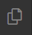
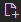

# `main.py` erstellen

Du benötigst eine Datei namens `main.py`, damit CodeCrafter weiß, wo dein Code anfängt. Du kannst diese Datei erstellen, indem du in dem linken Menü das Dateisymbol  
  
anklickst. 

> [!TIP]
> Falls die Seitenleiste dadurch verschwindet, kannst du sie wieder einblenden, indem du erneut auf das Dateisymbol klickst.

Jetzt kannst du oben, neben dem Namen des Ordners, das Datei-Erstellen-Symbol  anklicken. Jetzt kannst du den Namen der Datei eingeben. Gib `main.py` ein und drücke `Enter`. Jetzt öffnet sich die Datei und du kannst mit dem Programmieren anfangen.

> [!NOTE]
> Du kannst auch `Ctrl+N` drücken, um eine neue Datei zu erstellen.
